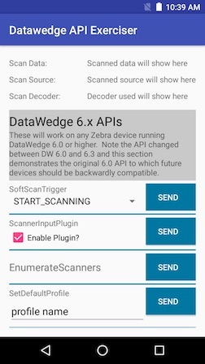
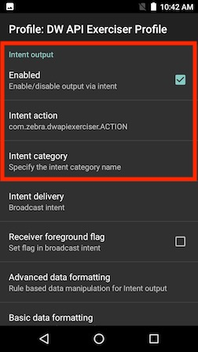

# DataWedge-API-Exerciser

*This application is intended for demonstration purposes only. It is provided as-is without guarantee or warranty and may be modified to suit individual needs.*
=========================================================



This application has been written to exercise the Zebra DataWedge Data Capture API (http://techdocs.zebra.com/datawedge/latest/guide/api/).

Refer to Zebra TechDocs: http://techdocs.zebra.com/datawedge/latest/guide/samples/datawedge-api-exerciser/

Zebra DataWedge is a 'zero code' solution to capture barcode, magnetic stripe and OCR data on Zebra devices.  DataWedge is a profile-based service running on Zebra mobile computers and offers an intent based API for user applications to interact and control.  The intent based API offers limited functionality for controlling the scanning and profile aspects of DataWedge

# Application to exercise:
* Receiving scan data via Intent
* The Intent API (details below)

## Device Configuration:
1. Set up a Datawedge profile that will be in effect when this application is run [to get started easily, just modify 'Profile0 (default)].  
2. Ensure Datawedge is enabled and the configured profile has enabled the 'Barcode input' plugin.  
  * To test steps 1 & 2 launch any app and press the barcode trigger, you should see a beam.
3. Configure the datawedge output plugin as follows.
  * Intent Output: Enabled
  * Intent action: com.zebra.dwapiexerciser.ACTION
  * Intent category: leave blank
  


**Note: If you are using the 6.3 APIs you can use CreateProfile to automatically create, configure and associate an appropriate profile which will work and enable scanning via intents**

## APIs (6.x):
* SoftScanTrigger - used to start, stop or toggle a software scanning trigger
* ScannerInputPlugin - enable/disable the scanner Plug-in used by the active Profile
* enumerateScanners - returns a list of scanners available on the device
* setDefaultProfile - sets the specified Profile as the default Profile
* resetDefaultProfile - resets the default Profile to Profile0
* switchToProfile - switches to the specified Profile

## APIs (6.2):
* Delete Profile
* Clone Profile
* Rename Profile
* Get Active Profile
* List Profiles
* Enable / Disable Datawedge

## APIs (6.3):
* Get Version Info
* Register / Unregister for (Scanner) Notifications
* Create Profile
* Set Config
* Restore Configuration
* 6.3 variants of the APIs first defined for 6.0 e.g. SoftScanTrigger etc.

## APIs (6.4):
* Set Config (using the 'auto' scanner)
* Get Datawedge status

## APIs (6.5):
* Result codes are given for supported APIs (mostly the Set... APIs)
* Get Config
* Get / Set Disabled App List
* Switch Scanner
* Switch Scanner Params

## APIs (6.6):
* Set Reporting Options
* Switch Scanner by Friendly Name

## APIs (6.7)
* Set Import Config

## APIs (6.8)
* Ignore Disabled Profiles
* Get Ignore Disabled Profiles Status
* Set Simulscan Params

## Use:
Hopefully the UI is self explanatory.  Returned barcode data is shown at the top of the view with some indication whether the intent (from Datawedge) was invoked through startActivity(), sendBroadcast() or startService().

To mimic DataWedge on a non-Zebra device you can use adb to send an intent of the same format that DataWedge would usually send on scan:
For startActivity:
```
adb shell am start -a com.zebra.dwapiexerciser.ACTION -e com.symbol.datawedge.data_string 0123456789 -e com.symbol.datawedge.source scanner -e com.symbol.datawedge.label_type EAN13
```
or for broadcast:
```
adb shell am broadcast -a com.zebra.dwapiexerciser.ACTION -e com.symbol.datawedge.data_string 0123456789 -e com.symbol.datawedge.source scanner -e com.symbol.datawedge.label_type EAN13
```


